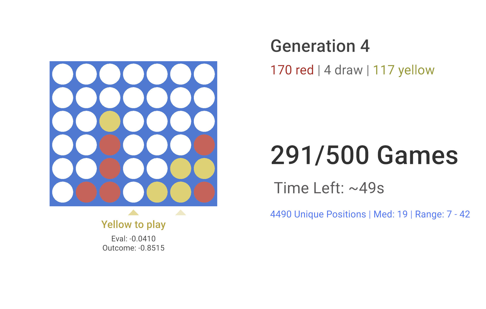

# Connect Four MCTS AI

An AI that learns to play Connect Four entirely through self-play, utilizing Monte Carlo Tree Search (MCTS) and a custom-built neural network.

## About
This project (built in Unity) includes a fully functional Connect Four environment along with a dedicated training scene. The AI improves over time by playing against versions of itself, training both a Value network (to evaluate board positions) and a Policy network (to suggest the best moves).

## Key Features
*   **Monte Carlo Tree Search:** Uses MCTS to explore potential future moves. The search is guided by the Policy network to narrow down viable moves, which are then evaluated deeper using the Value network.
*   **Custom Neural Network:** A custom C# implementation of a neural network using fully connected dense layers. Policy network uses softmax + cross-entropy loss, value network uses tanh + mean squared error loss. ReLU is used for hidden layers.
*   **Real-time Training UI:** A user-friendly interface which provides snapshots of the AI's self-play games, as well as its thinking process. Includes additional statistics such as average game length and win % for each player.
*   **Self-Play Reinforcement Learning:** The model starts with zero knowledge and gathers its own training data by playing thousands of games against itself.

## Technical Stack
*   **Environment:** Unity
*   **Language:** C#

## How It's Trained
1.  **Data Gathering:** The AI plays thousands of games against itself, with temperature added. This means at each turn, it doesn't necessarily play what it thinks is "best", but instead chooses randomly with a bias for better moves.
2.  **Value Network:** The Value network is trained on the outcomes of these games. If a position ended with a win for Red, it is labeled as +1. A win for yellow is labeled as -1. This way, it learns to evaluate which positions are good for which players.
3.  **Policy Network:** The Policy network is trained on what the AI decided as the "best moves" after a thorough search. For example, if after searching through 1000 positions, the AI decided going in the center was the best move, the Policy network is trained to output the center move with a higher value.
